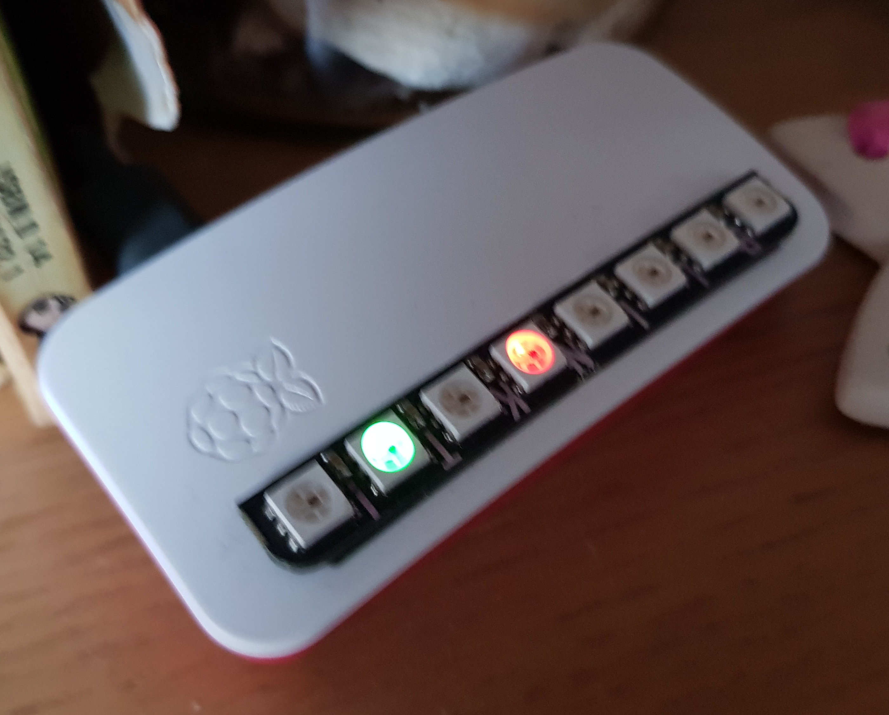

# PiTrains
Live train notification tool for **Raspberry Pi** and **Blinkt**!
A live UK train departure board to check before you walk out the door.
Uses the **OpenLDBWS** service to show the live running status of direct trains between your specified stations.
## EXAMPLE

## ABOUT
Each of the eight LEDs on the Blinkt represents a 5 minute time window. The colour of each LED indicates the train(s) available in that time window:
1. Black/Unlit = no train.
2. White = a train is imminent/on platform/just left.
3. Green = an on-time train.
4. Yellow = a delayed train (this is the actual delayed time, not the pre-delay scheduled time.)
5. Blue = unspecified delay (there was supposed to be a train, but it is delayed and the delay period is not specified.)
6. Red = a cancelled train (there was supposed to be a train, but now it's not coming.)
If there are multiple trains in the time window, the "best" LED state is set - White>Green>Yellow>Blue>Red>Black.
## ENVIRONMENT
1. Make sure the time on your Pi is correct.
2. You might want to use a Python [virtual environment](https://docs.python.org/3/library/venv.html).
3. Install Python dependencies with `pip install -r requirements.txt`
4. Sign up for OpenLDBWS and get your API key [here](http://realtime.nationalrail.co.uk/OpenLDBWSRegistration/).
5. Create a DARWIN_WEBSERVICE_API_KEY environment variable (your API key).
6. Create a DEPARTURE_CRS_CODE environment variable (see [this list](http://www.railwaycodes.org.uk/crs/CRS0.shtm)).
7. Create DESTINATION_CRS_CODE environment variable (see [this list](http://www.railwaycodes.org.uk/crs/CRS0.shtm)).
8. Run on cron.
